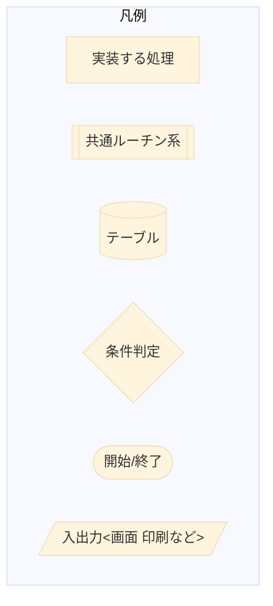
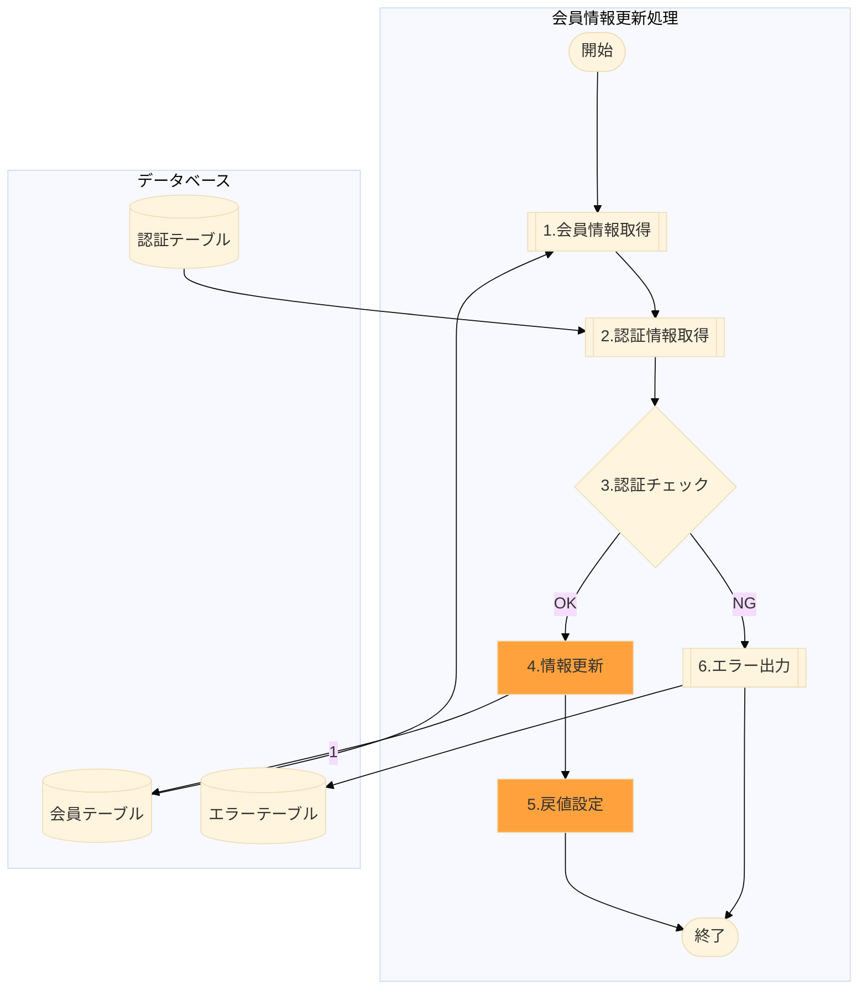

# 講義
- RENSHUフォルダは練習です
## mermaidもかけます

# ここから「処理概要ドキュメント」の記述例
## 処理概要
1. 会員情報取得
    1. 共通関数で要求電文の会員番号から会員テーブルの情報を取得する
2. 認証情報取得
   1. 共通関数で認証情報テーブルから会員番号の情報を取得する
3. 認証チェック
   1. 要求電文のパスワードをハッシュ化したものと2.認証情報で取得したハッシュ値を比較
   2. OKなら情報更新へ
   3. NGならエラー出力へ
4. 情報更新
   1. 会員テーブルの情報を要求電文で更新
5. 戻値設定
   1. 呼び出し元への戻り値を設定する
6. エラー出力
   1. 共通関数でエラーテーブルへ情報を出力する

## 処理フロー

## DB 操作
<pre>
UPDATE member_info
SET num = inum, name = iname, ... 
WHERE num = inum;
</pre>